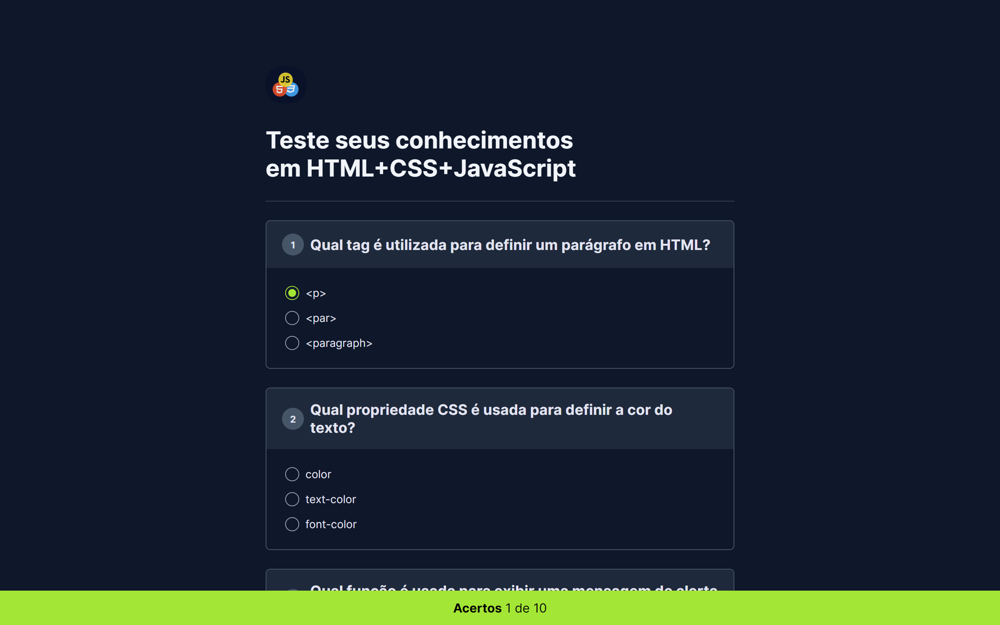

  

<h1 align="center">HTML+CSS+Javascript Challenge</h1>

  <a href="#tecnologias">Tecnologias</a>&nbsp;&nbsp;&nbsp;|&nbsp;&nbsp;&nbsp;
  <a href="#projeto">Projeto</a>&nbsp;&nbsp;&nbsp;|&nbsp;&nbsp;&nbsp;
  &nbsp;&nbsp;&nbsp;|&nbsp;&nbsp;&nbsp;
  <a href="#licenca">Licença</a>

  

  

## 🛠 Tecnologias

Esse projeto foi desenvolvido com as seguintes tecnologias:

- HTML
- CSS
- Javascript

## 💻 Projeto

O HTML+CSS+JS Challenge é um quiz pra testar os seus conhecimentos técnicos em HTMl, CSS e Javascript e ter um retorno sobre a quantidade de questões que você acertou.

- [Acesse o projeto finalizado, online](https://html-css-js-challenge.netlify.app/)

## 🤝 Criador

<table>
  <tr>
    <td align="center">
      <a href="https://github.com/pedroeuzebioo" title="Github do Pedro Euzebio">
         
        
          <b>Pedro Euzebio</b>
        
      </a>
    </td>
  </tr>
</table>

## 📝 Licença

Esse projeto está sob licença MIT. Veja o arquivo [LICENÇA](LICENSE.md) para mais detalhes.

---
